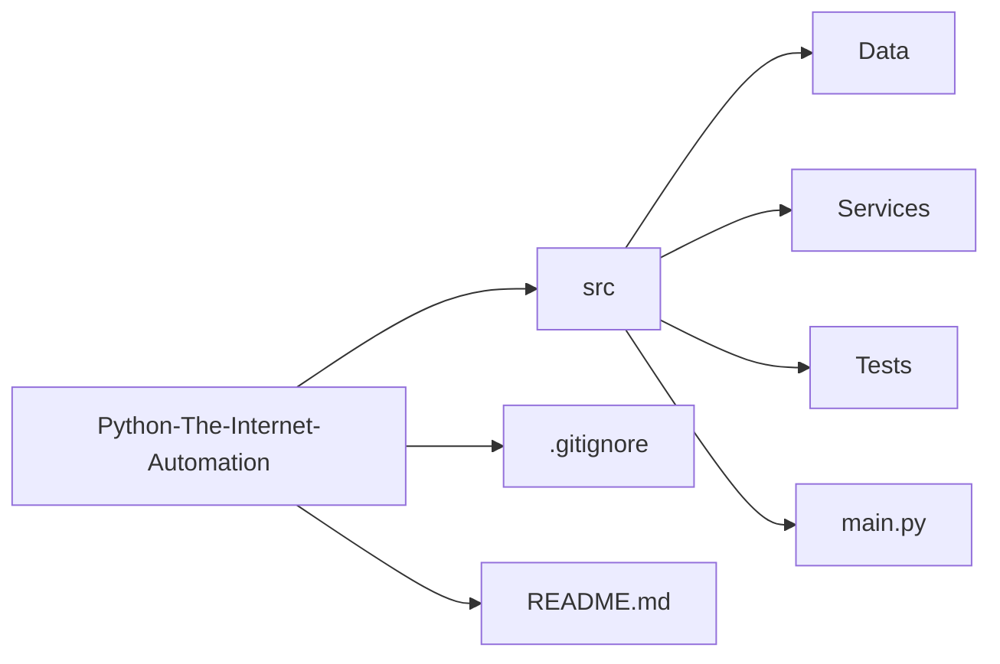

# Automatizar The-Internet

Esse repositório tem como objetivo criar soluções de automação para o site [The-Internet](https://the-internet.herokuapp.com/).

## Entendendo o projeto

O projeto consiste em criar uma automação para cada um dos 44 casos apresentados no site.

Cada um dos testes terá a sua própria classe que será chamada apenas quando se fizer necessária sua aplicação.

Cada um dos cenários terá uma explicação mais detalhada no [Readme]() que constará na pasta [Scenarios]().

## Objetivos do projeto

1. Criar soluções de automação para a web;
2. Evitar trabalho repetitivo;
3. Solucionar problemas de automação web;
4. Testar páginas web;
5. Raspar dados da internet;
6. Demonstrar habilidades de programação e automação.

## Tecnologias utilizadas

1. **Python**;
2. **Playwright**;
3. **Pyautogui**;

## Checklist de cenários implementados

- [x] A/B Testing
- [x] Add/Remove Elements
- [x] Basic Auth
- [x] Broken Images
- [x] Challenging DOM
- [x] Checkboxes
- [x] Context Menu
- [x] Digest Authentication
- [x] Disappearing Elements
- [x] Drag and Drop
- [x] Dropdown
- [x] Dynamic Content
- [x] Dynamic Controls
- [x] Dynamic Loading
- [x] Entry Ad
- [x] Exit Intent
- [ ] File Download
- [ ] File Upload
- [ ] Floating Menu
- [x] Forgot Password
- [x] Form Authentication
- [ ] Frames
- [ ] Geolocation
- [ ] Horizontal Slider
- [ ] Hovers
- [ ] Infinite Scroll
- [ ] Inputs
- [ ] JQuery UI Menus
- [ ] JavaScript Alerts
- [ ] JavaScript onload event error
- [ ] Key Presses
- [ ] Large & Deep DOM
- [ ] Multiple Windows
- [ ] Nested Frames
- [ ] Notification Messages
- [ ] Redirect Link
- [ ] Secure File Download
- [ ] Shadow DOM
- [ ] Shifting Content
- [ ] Slow Resources
- [ ] Sortable Data Tables
- [ ] Status Codes
- [x] Typos
- [ ] WYSIWYG Editor

## Arquitetura de pasta do projeto
